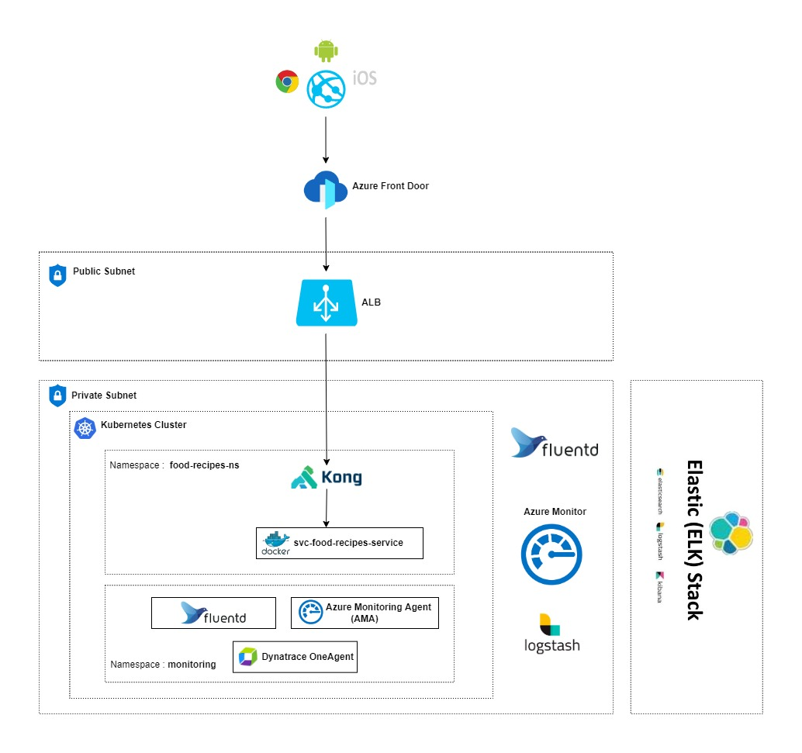

# Food Recipe App with JWT

Recipe App is created using JWT and Eureka. This solution can be found in below link

https://github.com/noblesebastianofficial/food-recipes-app

# Food Recipe App without JWT

This APP is created using basic authentication.This micro services contains the Food Recipes API . This API allows users to manage your favourite recipes.
These API’s  show all available recipes and the actions to create, update and delete a recipe.

Credentials are given as plain text. Later this can be moved to vault or implement jwt using identity 
management solutions.

* User name- admin
* password-  password

## Software Requirements

* [Java](https://www.oracle.com/java/)
* [Maven](https://maven.apache.org/)
* [Spring Boot](https://spring.io/projects/spring-boot)
* [H2 Database](https://www.h2database.com/html/main.html)
* [jUnit](https://junit.org/)
* [mockito](https://site.mockito.org/)
* [Docker](https://www.docker.com/)

## Application Envision Architecture



## How to run the application

## Running the application using docker

### Installation

Use the maven command line interface [Maven](https://maven.apache.org/) to install the dependencies

```bash
mvn install -DSkipTests
```

### Test
Use the maven command line interface [Maven](https://maven.apache.org/) to perform unit test
```bash
mvn test
```
### package build
```bash
mvn package
```
### Docker build
```bash
docker build --rm -f "Dockerfile" -t foodrecipeapp:latest "."
```

### How the docker image is build
* Base image for the docker container is `openjdk:11-jdk`

* Compiled class files under `target/food-recipes-service-1.0.1.0-SNAPSHOT.jar  ` are copied to `webapp.jar` in the image

### How to run docker container

```bash
docker container run  -p 9091:9091 -d --rm --name food-recipes-service foodrecipeapp:latest
```
## How to run the application in Kubernetics

* push the created image to Docker container registry using push command
  `docker tag 092f82fa7ed7 noblesebastiank/foodrecipeapp:latest`
  `docker push noblesebastiank/foodrecipeapp:latest`
* connect to cloud kubernetes cluster
* Deploy the image to kubernetics pod using apply command
  ` kubectl apply -f deployment.yaml`
* Check the status of the pod
  ` Kubectl get pods`
* Test the application

## How to run the application in Azure Cloud

* Create build pipe line using mvn template or default template
* Define stages for using mvn template, add stages like test,pakage,build image,push image to docker container registry
* Create release piple line in cloud and deploy the deployment.yaml
  ` kubectl apply -f deployment.yaml`
* Check the status of the pod
  ` Kubectl get pods`
* Test the application

## Running the application with IDE

There are several ways to run a Spring Boot application on your local machine. One way is to execute the `main` method in the `com.mycompany.recipe.Application` class from your IDE.

* 	Download the zip or clone the Git repository.
* 	Unzip the zip file (if you downloaded one)
* 	Open Command Prompt and Change directory (cd) to folder containing pom.xml
* 	Open Eclipse
     * File -> Import -> Existing Maven Project -> Navigate to the folder where you unzipped the zip
     * Select the project
* 	Open Intleji
     * File->Open -> Navigate to the folder where you unzipped the zip
     * Select the project
* 	Choose the Spring Boot Application file (search for @SpringBootApplication)
* 	Right Click on the file and Run as Java Application


## Health Check

+
    - path : /food-recipes-service/health
    - port : 9091

## Data Contract

+
    - path : food-recipes-open-api.yaml
    - open [swaggerEditor](https://editor.swagger.io)  then paste the contents in openapi.yaml

## Swagger URL
-  http://localhost:9091/swagger-ui/index.html

## API collection
- got to directory ./postman-collection. Here you can see the postman collection


## Test Coverage
- More than 90 % Test coverage for all classes other than classes under package model and dtos, it can be viewed 
  using Jacoco
